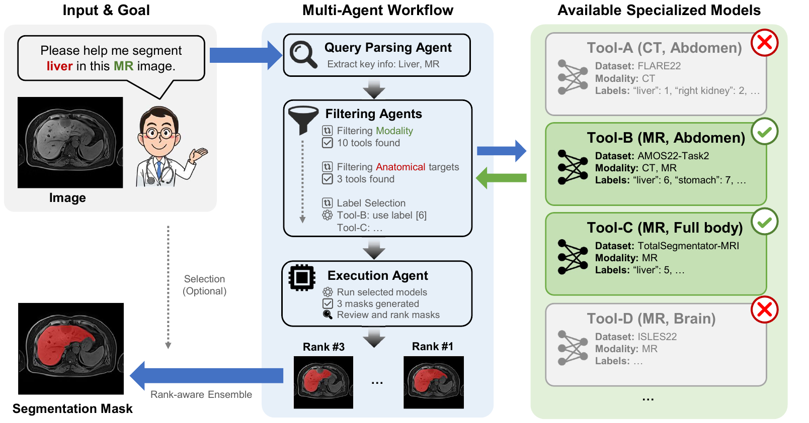

# MedSegAgent: Universal & Scalable Multi-Agent System for Instructive Medical Image Segmentation

This work has been accepted by the *IEEE Journal of Biomedical and Health Informatics (JBHI)*. Paper: [IEEE Xplore](https://ieeexplore.ieee.org/document/11455620).

<p align="center">
  
</p>

<p align="center">
  <em>Overview of the MedSegAgent framework: natural language query parsing, coarse-to-fine dataset matching, and final segmentation with result integration.</em>
</p>

MedSegAgent is a multi-agent system for instructive medical image segmentation. Instead of training one universal segmentation model, it orchestrates specialized dataset-specific models through natural language understanding, coarse-to-fine dataset matching, and execution-time result integration.

## Key Features:
* **Universal & Scalable:** Tackle diverse medical image segmentation tasks using natural language instructions.
* **Precise Automation:** Automatically selects the most suitable segmentation models.
* **Enhanced Robustness:** Improves reliability through multi-model integration and ensemble capabilities.

## Overview
MedSegAgent parses a free-form segmentation request, filters candidate datasets from modality to anatomy to label, and then runs the matched segmentation models. The current repository organizes each integrated dataset with a standardized JSON metadata entry in [`dataset/`](dataset), making it straightforward to extend the model library with new tasks.

In the paper setting, MedSegAgent integrates 23 datasets and supports 343 segmentation targets across CT, MRI, PET/CT, and ultrasound-related scenarios.

## Supported Datasets
The repository currently includes metadata for the following datasets and targets. The summary below is adapted from the dataset table in the paper.

| Dataset | Modalities | Body Region | Representative Targets |
| --- | --- | --- | --- |
| TotalSegmentator v2 | CT | Whole-body | 117 structures including organs, vessels, bones, and brain |
| TotalSegmentator MRI | MRI | Whole-body | 56 structures including organs, vessels, spine, muscles, and brain |
| CT-ORG | CT | Whole-body | liver, bladder, lungs, kidneys, bone, brain |
| AutoPET | PET/CT | Whole-body | whole-body tumor sites |
| SegRap2023 Task1 | CT | Head and neck | 45 OAR structures |
| BraTS21 | MRI | Head and neck | whole tumor, tumor core, enhancing tumor |
| ISLES22 | MRI | Head and neck | stroke lesion |
| ISLES22 ATLAS | MRI | Head and neck | stroke lesion |
| Instance22 | CT | Head and neck | intracranial hemorrhage |
| HECKTOR2022 | PET/CT | Head and neck | GTVp, GTVnd |
| SegRap2023 Task2 | CT | Head and neck | GTVp, GTVnd |
| MM-WHS | MRI, CT | Heart | cardiac chambers, myocardium, great vessels |
| ACDC | MRI | Heart | left ventricle, right ventricle, myocardium |
| ImageCAS | CT | Heart | coronary artery |
| Parse22 | CT | Thorax | pulmonary artery |
| ATM22 | CT | Thorax | pulmonary airway |
| AbdomenAtlasMini | CT | Abdomen | kidneys, liver, pancreas, spleen, stomach, vessels |
| AMOS22 Task2 | MRI, CT | Abdomen | 15 abdominal and pelvic structures |
| FLARE22 | CT | Abdomen | 13 abdominal organs |
| WORD | CT | Abdomen | abdominal organs, bowel, bladder, femurs |
| KiTS23 | CT | Abdomen | kidneys, renal tumors, renal cysts |
| LiTS | CT | Abdomen | liver, liver tumor |
| Adrenal-ACC-Ki67-Seg | CT | Abdomen | adrenocortical carcinoma |

## Quick Start:
### Setup your environment
```
conda create -n medsegagent python=3.12
conda activate medsegagent
pip install uv
uv pip install -r requirements.txt
```
Then set your LLM service API keys like [OAI_CONFIG_LIST.example](OAI_CONFIG_LIST.example), the config file should be named `OAI_CONFIG_LIST`.
```
[
    {
        "model": "Qwen/Qwen2.5-32B-Instruct",
        "api_key": "<Your API KEY>",
        "base_url": "https://api.siliconflow.cn/v1",
        "tags": ["silicon"]
    },
    {
        "model": "gpt-4o-2024-08-06",
        "api_key": "<Your API KEY>",
        "base_url": "<your BASE URL>",
        "tags": ["openai"]
    }
]
```
### Test script
Start from eval_example.sh to try our Coarse-to-Fine setting of seg model selection.
```
python ./evaluate.py \
    --test_file_path "model_selection_test_case.jsonl" \
    --test_pattern "C2F"  \
    --model "gpt-4o-2024-08-06"    \
    --log_to_file
```

## Acknowledgments
This project builds on the open contributions of the medical image segmentation community. We gratefully acknowledge the creators and maintainers of the public datasets integrated in MedSegAgent, whose annotations, benchmarks, and challenge platforms make this system possible.

We also acknowledge [`nnU-Net`](https://github.com/MIC-DKFZ/nnUNet), which provides the strong self-configuring segmentation framework used for the dataset-specific models in our study.

## Citation
If you use MedSegAgent in your research, please cite:

```bibtex
@ARTICLE{11455620,
  author={Huang, Ziyan and Wang, Haoyu and Ye, Jin and Ji, Yuanfeng and Hu, Xiaowei and Liu, Lihao and Yang, Zhikai and Li, Wei and Hu, Ming and Su, Yanzhou and Li, Tianbin and Gu, Yun and Zhang, Shaoting and Qiao, Yu and Gu, Lixu and He, Junjun},
  journal={IEEE Journal of Biomedical and Health Informatics},
  title={MedSegAgent: A Universal and Scalable Multi-Agent System for Instructive Medical Image Segmentation},
  year={2026},
  volume={},
  number={},
  pages={1-12},
  keywords={Image segmentation;Medical diagnostic imaging;Filtering;Solid modeling;Natural languages;Computed tomography;Computational modeling;Accuracy;Multi-agent systems;Liver;Universal Medical Image Segmentation;Multi-Agent System;Natural Language Instruction},
  doi={10.1109/JBHI.2026.3677444}
}
```
