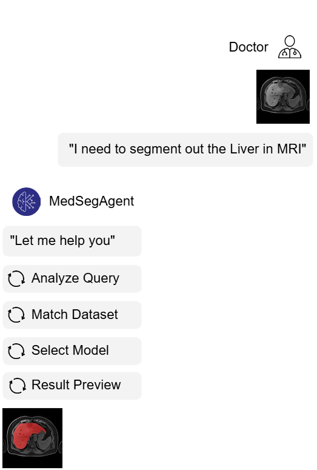

# Med-SegAgent: Universal & Scalable Multi-Agent System for Instructive Medical Image Segmentation

<!-- <div align="center">
  
</div> -->

## Key Features:
* **Universal & Scalable:** Tackle diverse medical image segmentation tasks using natural language instructions.
* **Precise Automation:** Automatically selects the most suitable segmentation models.
* **Enhanced Robustness:** Improves reliability through multi-model integration and ensemble capabilities.

## Quick Start:
### Setup your environment
```
conda create -n medsegagent python=3.12
conda activate medsegagent
pip install uv
uv pip install -r requirements.txt
```
Then set your LLM service API keys like [OAI_CONFIG_LIST.example](OAI_CONFIG_LIST.example), the config file should be named `OAI_CONFIG_LIST`.
```
[
    {
        "model": "Qwen/Qwen2.5-32B-Instruct",
        "api_key": "<Your API KEY>",
        "base_url": "https://api.siliconflow.cn/v1",
        "tags": ["silicon"]
    },
    {
        "model": "gpt-4o-2024-08-06",
        "api_key": "<Your API KEY>",
        "base_url": "<your BASE URL>",
        "tags": ["openai"]
    }
]
```
### Test script
Start from eval_example.sh to try our Coarse-to-Fine setting of seg model selection.
```
python ./evaluate.py \
    --test_file_path "model_selection_test_case.jsonl" \
    --test_pattern "C2F"  \
    --model "gpt-4o-2024-08-06"    \
    --log_to_file
```
