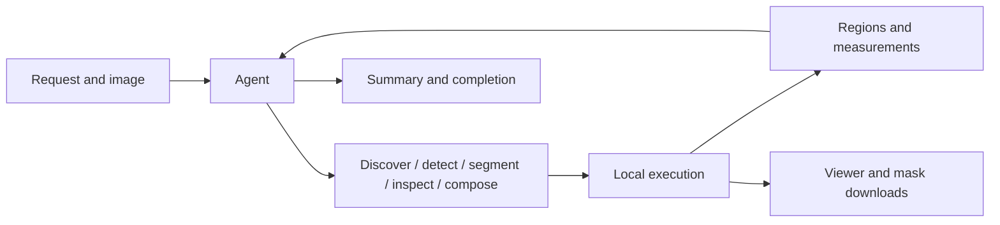

# Agent workflow

TotalSeg Agent uses native function calling to turn a natural-language request into
segmentation, inspection and mask composition. It selects each next action from the
request and the results already available.

## Choose and run models

The Agent catalog provides supported model names, labels, quality modes, acquisition
requirements and weight readiness. The current configuration offers 33 public CT/MR tasks.
Unavailable models and license-policy diagnostics are excluded from Agent discovery.
The Agent can discover details on demand, select a model explicitly or use the default
model for a requested structure.

A `segment` action can name one model or up to eight models for the same targets.
Targets sharing a model and quality are batched. Independent models run concurrently
when GPUs are available; CPU and MPS use one inference at a time. Previously completed
work is reused within the execution for the same model and quality.

Each model keeps its own regions. Whole CT lungs expand to five lobes and MR lungs to
two native labels. Region inspection reports voxel counts, volumes and overlap.
Composition produces unions, intersections and ordered differences on the source grid.

## Determine modality

A structured CT/MR declaration sets the modality directly. Otherwise, the Agent can use
a declaration in the request, the known modality of an installed example or the
`detect_modality` tool's local observations.

Detection reads DICOM acquisition metadata or a same-name NIfTI conversion JSON first.
For NIfTI without usable metadata, it reports intensity statistics and observations from
TotalSegmentator's bundled CT/MR classifier. Its vote fraction describes model agreement;
uncertain observations are returned with reasons. The Agent combines this evidence with
the request and asks for clarification when needed.

Detection supplies evidence. The first valid `segment` action establishes the chosen
modality for the execution; subsequent actions use that choice. The task records the
choice and detection evidence separately.

## Continue and finish

After each tool result, the Agent can segment additional targets, inspect a region,
compose masks or finish. An explicit `supersedes` argument lets a successful alternative
model or quality replace a failed attempt for the same target. The original attempt and
replacement are retained in the execution record.

The Agent calls `finish_task(status, summary, unresolved)` to report completion, request
input or report failure. Completion requires output files and resolution of recorded
execution failures. This control action belongs to the Agent loop; MCP exposes the five
work tools for its caller's own loop. Broad anatomical requests can complete when the
supported structures have been segmented; they do not implicitly require every finer
substructure. Explicitly requested missing targets or operations remain unresolved.
The final summary briefly names the outputs in the user's language. It mentions a
scope limit only when needed to avoid misunderstanding, and omits routine modality
evidence, model setup and deployment details.

Internal runs default to 24 model requests, 64 work-tool calls and a 7200-second task
deadline. Cancellation stops the active inference process group. Web/A2A message IDs
support replay and task recovery; published results stay available across service restarts
for their retention period. Interrupted inference is recorded as failed.

## Outputs

Each execution stores model artifacts and named regions referencing their labels.
Regions from different models can overlap. Volumes use voxel sets, including for
compositions, so overlapping voxels are counted once.

Web and A2A publish requested regions through `outputs[]` and `regions[]`, with a summary
and completion status. The viewer uses a merged mask with consecutive label IDs from 1.
Class downloads are separate binary NIfTI files with values 0 and 1 and the source geometry.
Partial results retain the task's actual completion status.

CLI and MCP return local files with selectors for the requested labels. Follow the
returned region and label IDs for each file. Their native files can contain additional
labels used to construct a requested region.

The language provider receives text and structured tool feedback: region IDs, model
choices, counts, volumes and compact geometry observations. Source images, mask arrays,
file paths and raw process logs stay on the inference host. MCP returns local paths to
its calling client.

Task `timings` separates model requests, tool actions, device waiting, inference and
publication. Inference is included within tool time, and parallel model durations can
overlap; `elapsed_seconds` gives the total wall time.

See the [tool reference](tool-management.md) for arguments and execution details,
[CLI and MCP](simple-local-tools.md) for local use, or [A2A integration](a2a.md) for clients.
