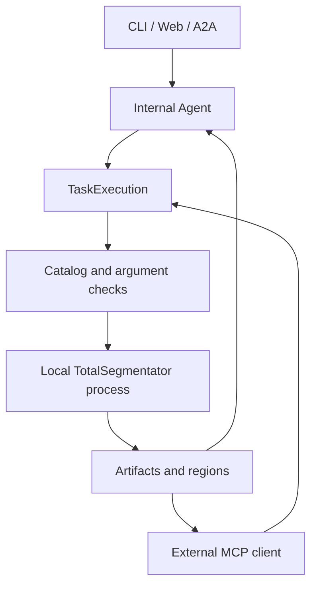

# Tool reference

The internal Agent and MCP share five work operations. The Agent also has a
`finish_task` action for reporting the outcome of a request.

| Operation | Native Agent arguments | Result |
| --- | --- | --- |
| `get_capabilities` | `query?`, `task?`, `modality?` | Model catalog, labels, modes and requirements |
| `detect_modality` | None | Acquisition metadata and local CT/MR observations |
| `segment` | `targets`, `task?`, `quality?`, `modality?`, `supersedes?` | Segmentation regions and measurements |
| `inspect_artifact` | `region_ids` | Region volumes, empty status and spatial overlap |
| `compose_masks` | `operation`, `region_ids`, `name` | Union, intersection or ordered difference |

## Discover capabilities

`get_capabilities()` exposes the 33 service-supported tasks: 27 CT and 6 MR. Search,
exact task queries and tool schemas use the same allowed set. Excluded models and
deployment-policy diagnostics stay outside Agent and MCP discovery. The CLI `catalog`
command retains the full upstream registry for administration.

```json
{"query": "lung", "modality": "CT"}
```

Search matches task names, native labels and composite targets. Queries accept commas,
`+` and `and`, while preserving native labels such as `kidney_left`. An exact compound
label takes precedence over matches to its individual words.

```json
{"task": "total", "query": "liver"}
```

An explicit task returns exact labels and IDs, auxiliary labels, supported quality
modes, default quality, ROI support, dependencies and acquisition prerequisites.
A `query` narrows its labels to the requested structures. Explicit task details also
check local `weight_readiness` by quality and `roi_weight_readiness` for ROI dependencies.
Inference checks the files needed by the chosen action again before running.

## Segment and compose

`segment.task` accepts a model name or an array of up to eight distinct models:

```json
{"targets": ["liver"], "task": ["total", "total_v3"], "quality": "fast"}
```

Every selected model must support the targets and quality. The executor validates the
whole action, groups targets by model and quality, and runs missing work. Independent
models share available GPU capacity. Results are registered in request order.

An omitted model uses stable defaults for the modality and target. Exact native labels
belong to their selected model. Whole CT lungs expand to all five lobes; MR lungs use
the two native lung labels. Quality choices are `fastest`, `fast` and `standard`, with
a supported subset and default defined per model.

When modality is unknown, `segment` requires `modality`. A declaration or the first
valid segmentation choice establishes CT/MR for the execution. Subsequent native
schemas use that modality and its available model choices. `detect_modality` returns
evidence for the choice; structured declarations take precedence.

Inspection and composition reference region IDs from the current execution.
`compose_masks` supports `union`, `intersection` and `difference`; difference subtracts
all later regions from the first. Composition names may contain spaces or Chinese.
Different models or quality modes retain distinct output identities and measurements.

To replace a failed attempt, choose one alternative model or quality and provide:

```json
{"supersedes": [{"task": "total", "target": "liver", "quality": "fast"}]}
```

The replacement resolves the failed target after successful execution. The original
failure remains recorded. A comparison requesting both models still requires results
from both. `supersedes` accepts one replacement model rather than a model array.

## Execution path



`tool_definitions.py` owns the shared descriptions and native JSON input schemas.
`agent.py` sends these in OpenAI-compatible Chat Completions requests to
`deepseek-v4-flash`. It supplies the user request, known modality and accumulated tool
feedback. Exact model labels are loaded through catalog queries as needed.

The host parses native function arguments and dispatches them to `TaskExecution.call`.
The executor validates inputs, resolves labels and reuses completed work before calling
the inference core. Core runs TotalSegmentator in a separate process with its leased
device, timeout and output checks. Feedback returns through matching `tool_call_id`
messages. Multiple model actions run in sequence; independent models within one
segmentation action can run concurrently.

Provider feedback includes status, region IDs, model and quality, counts, volumes,
overlap and modality observations. It excludes image arrays, local paths and raw logs.
Each feedback object is bounded to 256 KiB. Host code owns file paths and runtime settings.

`finish_task(status, summary, unresolved)` is handled by the Agent loop after work
results are available. Completed requests require outputs and resolution of recorded
execution failures. The defaults are 24 provider requests and 64 work-tool calls;
`finish_task` uses the provider budget but does not consume a work-tool call.
`MEDSEGAGENT_MAX_MODEL_REQUESTS` accepts 1–128 and `MEDSEGAGENT_MAX_TOOL_CALLS` accepts
1–256. CLI and Web/A2A also apply the configured total task deadline.

## Interface adapters

MCP's `mcp_server.py` adds local input/output paths and an execution ID to the shared
operations. Clients discover them through `tools/list` and invoke them through
`tools/call`. The external client owns its model loop; the MCP server returns local
results directly. See [CLI and MCP](simple-local-tools.md) for its complete arguments.

Web and A2A submit an image reference and a natural-language request to the internal
Agent. A2A describes this service through its Agent Card and returns task updates and
file Artifacts. The CLI `route` command is a text-only preview that uses discovery and
one model selection; `run` performs the complete workflow.

Tests compare MCP tool listings with the shared native declarations and cover catalog,
execution, output identity and interface behavior. See [development checks](validation.md).
